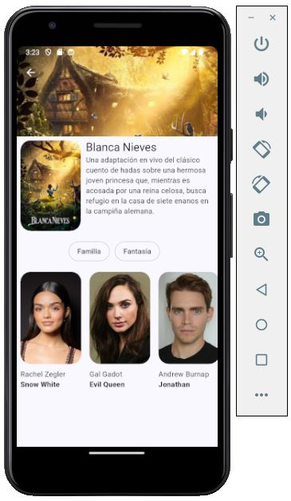

# cinemapedia

1. Copiar el archivo .env.template y renombrarlo a .env
2. Remplazar variables

## Pantalla de Inicio

Se muestra un slide con las peliculas de estreno.  
Abajo se muestra un slide horizantal para proximas peliculas.

   

      
   

### Detalle Pelicula

   

      
   

### Actores en la pelicula

   

      
   

 
